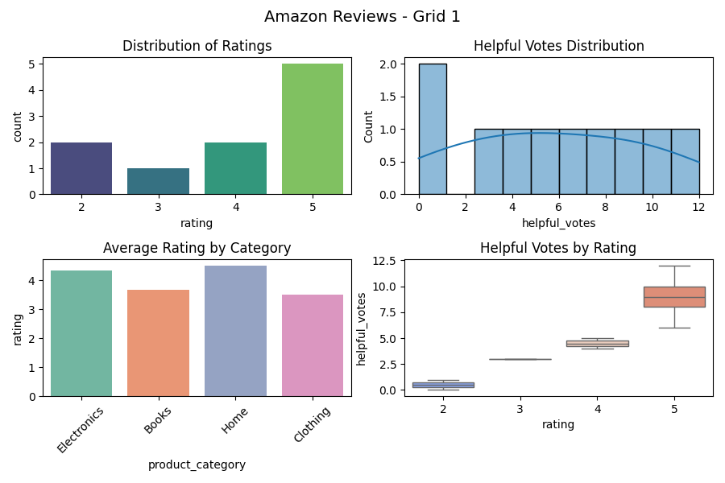
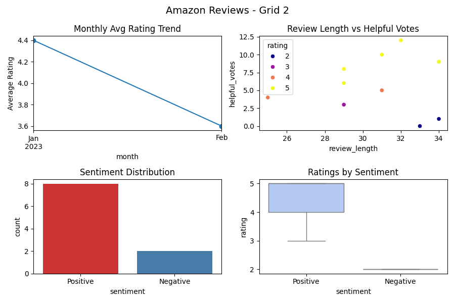
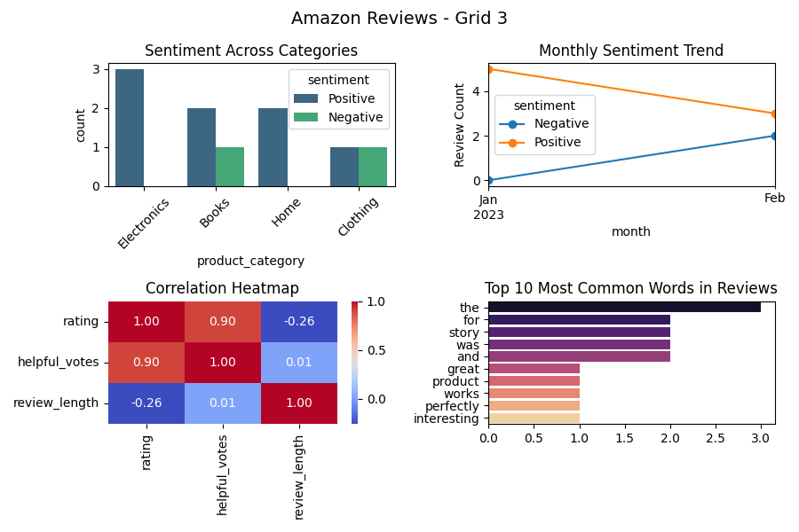

# Amazon Reviews - Full Analysis

**Task – Amazon Reviews Dataset | Data Science Internship**

## Objective
Perform Exploratory Data Analysis (EDA) and Sentiment Analysis on the Amazon Reviews dataset.

## Features
- Data cleaning (removing duplicates, handling missing values)
- Word frequency and common terms
- Sentiment polarity and subjectivity using TextBlob
- Visualizations: countplots, histograms, bar charts
- Insights into positive/negative/neutral reviews

## Tools Used
- Python (pandas, matplotlib, seaborn, textblob)
- Dataset: Amazon Reviews CSV

## Repository Structure
data/ # contains the dataset CSV
outputs/ # charts, plots, sentiment visualizations
task2.py # main analysis script
requirements.txt # dependencies
README.md # project documentation
.gitignore # ignored files

## How to Run
1. Clone this repository:
```bash
git clone https://github.com/LAASYA-SD30/SCT_DS_2.git

## Install required packages:
pip install -r requirements.txt

## Run the analysis script:
python task2.py

## Visualizations

### Grid 1 - Basic Distributions


### Grid 2 - Trends & Sentiment


### Grid 3 - Deep Dive & Text

